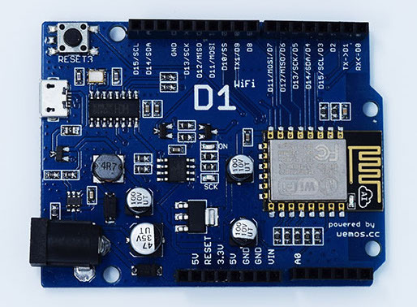
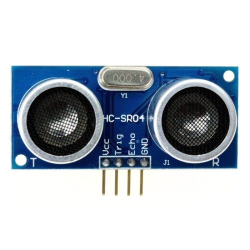
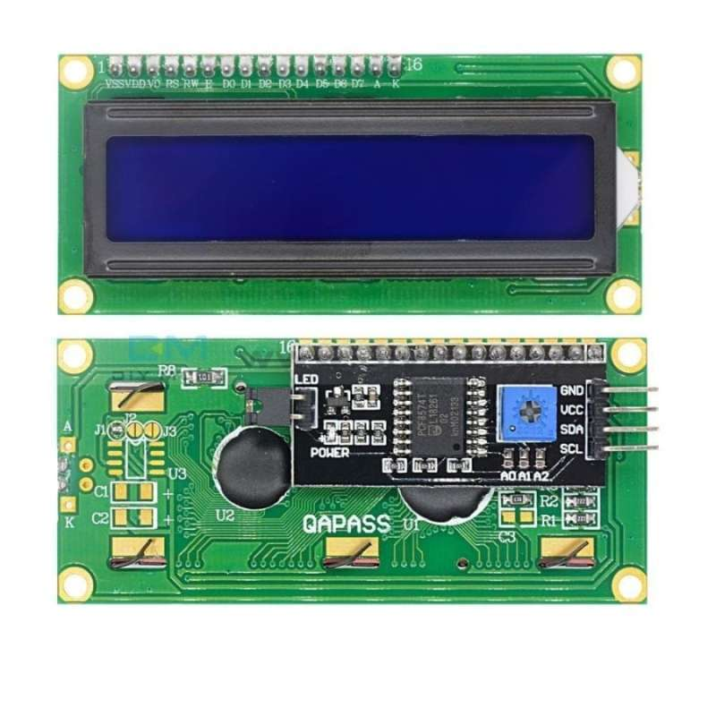
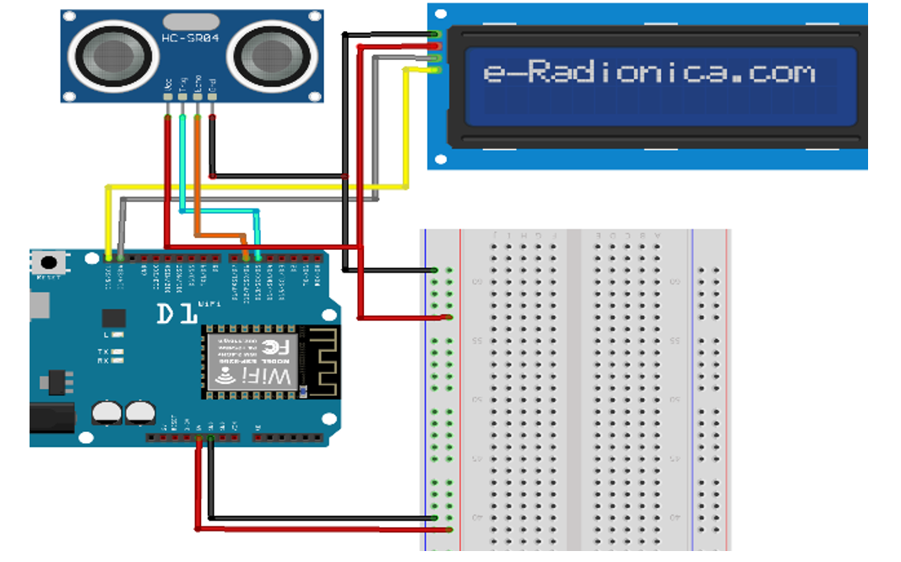

# 📦 Tutorial Setup SmartBin

### SmartBin menghubungkan perangkat IoT (sensor dan board ESP8266) dengan aplikasi web Laravel untuk mendeteksi sampah dan memberikan point secara otomatis, begitu pun sebaliknya. Sistem ini memanfaatkan Docker untuk kemudahan pengelolaan aplikasi backend, serta memungkinkan interaksi antara perangkat keras dan aplikasi menggunakan sensor ultrasonik dan LCD I2C.

## Pendahuluan
Selamat datang di tutorial setup **SmartBin**. Panduan ini bertujuan membantu Anda untuk:
- Menyatukan konfigurasi Laravel dan Arduino dalam sistem IoT.
- Menggunakan Docker untuk mempermudah pengelolaan aplikasi backend Laravel.
- Mengintegrasikan IP sensor ke dalam kontrol aplikasi web.

Pastikan Anda mengikuti langkah-langkah ini dengan urutan yang benar.

## Prasyarat Software
- Pastikan Anda telah menginstal **Docker** dan memiliki akses ke **Laradock**.
- Unduh dan instal **Arduino IDE** dari [situs resmi Arduino](https://www.arduino.cc/en/software).
- Gunakan text editor seperti **Visual Studio Code** atau **Notepad++** untuk mengedit file konfigurasi.

Jika belum, Anda bisa memeriksa dokumentasi atau video panduan untuk setiap alat tersebut.

---

## Prasyarat Hardware

<figure align="center">
  
  <figcaption>Wemos D1 ESP8266</figcaption>
</figure>

<figure align="center">
  
  <figcaption>Sensor Ultrasonic</figcaption>
</figure>

<figure align="center">
  
  <figcaption>LCD 16x2 I2C</figcaption>
</figure>

<figure align="center">
  
  <figcaption>RANGKAIAN KESELURUHANNYA</figcaption>
</figure>

---

## Langkah 1: Clone Repo
Clone repo `smartbin` ke dalam folder yang sama dengan Laradock. Struktur folder Anda akan menjadi seperti ini:
```
📂Develop/
├── 📁laradock -> adalah Blueprint/
└── 📁smartbin -> adalah repo ini/
```

---

## Langkah 2: Tambahkan Konfigurasi Nginx

Langkah pertama adalah menyiapkan file konfigurasi untuk Nginx agar aplikasi SmartBin bisa berjalan dengan benar.

1. **Salin file konfigurasi:**
   - Buka folder `laradock/nginx/sites/` di dalam proyek Anda.
   - Temukan file bernama `laravel.conf.example`. Salin (copy) file tersebut dan beri nama baru `smartbin.conf` di folder yang sama.

2. **Ubah konfigurasi:**
   - Setelah itu, buka file `smartbin.conf` yang baru Anda buat, dan salin seluruh konfigurasi berikut ini ke dalam file tersebut:

```nginx
#server {
#    listen 80;
#    server_name laravel.com.co;
#    return 301 https://laravel.com.co$request_uri;
#}

server {

    listen 80;
    listen [::]:80;

    # For https
    # listen 443 ssl;
    # listen [::]:443 ssl ipv6only=on;
    # ssl_certificate /etc/nginx/ssl/default.crt;
    # ssl_certificate_key /etc/nginx/ssl/default.key;

    server_name smartbin.test;
    root /var/www/smartbin/public;
    index index.php index.html index.htm;

    location / {
         try_files $uri $uri/ /index.php$is_args$args;
    }

    location ~ \.php$ {
        try_files $uri /index.php =404;
        fastcgi_pass php-upstream;
        fastcgi_index index.php;
        fastcgi_buffers 16 16k;
        fastcgi_buffer_size 32k;
        fastcgi_param SCRIPT_FILENAME $document_root$fastcgi_script_name;
        #fixes timeouts
        fastcgi_read_timeout 600;
        include fastcgi_params;
    }

    location ~ /\.ht {
        deny all;
    }

    location /.well-known/acme-challenge/ {
        root /var/www/letsencrypt/;
        log_not_found off;
    }

    error_log /var/log/nginx/smartbin_error.log;
    access_log /var/log/nginx/smartbin_access.log;
}
```

3. **Simpan perubahan:**
   - Setelah Anda menempelkan konfigurasi tersebut, simpan file `smartbin.conf`.

---

## Langkah 3: Edit File Hosts
1. Buka Notepad sebagai administrator (klik kanan, lalu pilih **Run as Administrator**).
2. Buka file `hosts` di:
   ```
   C:\Windows\System32\drivers\etc\hosts
   ```
3. Tambahkan baris berikut:
   ```
   127.0.0.1 smartbin.test
   ```
   **Contoh:**
   ```
   # localhost name resolution is handled within DNS itself.
   # 127.0.0.1       localhost
   # ::1             localhost
   127.0.0.1 smartbin.test
   ```

**Tips:** Jika Anda tidak bisa menyimpan perubahan file `hosts`, pastikan Anda menjalankan Notepad dengan hak administrator.

---

## Langkah 4: Berikan Izin dan Migrasi Database
1. Masuk ke container workspace Docker dan pindah ke folder smartbin:
   ```bash
   docker-compose exec workspace bash
   cd smartbin
   ```
2. Berikan izin penuh pada folder `storage`:
   ```bash
   chmod -R 777 storage
   chmod -R 777 storage/logs
   ```
3. Restart Nginx agar perubahan izin terbaca:
   ```bash
   docker-compose restart nginx
   ```
4. Jalankan migration untuk membuat tabel di database:
   ```bash
   php artisan migrate
   ```

---

## Langkah 5: Upload Kode Arduino
1. Buka Arduino IDE dan pastekan kode berikut:
   ```cpp
    #include <ESP8266WiFi.h>
    #include <ESP8266HTTPClient.h>
    #include <WiFiClient.h>
    #include <Wire.h>
    #include <LiquidCrystal_I2C.h>

    const char* ssid = "SABRI KUPI 3"; // Ganti dengan nama SSID WiFi kamu
    const char* password = "tehbotol"; // Ganti dengan password WiFi kamu

    const int trigPin = D5;
    const int echoPin = D6;
    unsigned long duration;
    int distance;

    // Inisialisasi LCD I2C dengan alamat 0x27 dan ukuran 16x2
    LiquidCrystal_I2C lcd(0x27, 16, 2);

    WiFiServer server(80);

    void setup() {
        Serial.begin(115200);
        WiFi.begin(ssid, password);

        while (WiFi.status() != WL_CONNECTED) {
            delay(1000);
            Serial.println("Connecting to WiFi...");
        }

        Serial.println("Connected to WiFi");
        Serial.println("IP Address: ");
        Serial.println(WiFi.localIP());

        // Inisialisasi LCD
        lcd.init(); // Inisialisasi LCD
        lcd.backlight(); // Menyalakan backlight

        lcd.setCursor(0, 0);
        lcd.print("IP: ");
        lcd.print(WiFi.localIP()); // Menampilkan IP di LCD
        delay(2000); // Tampilkan selama 2 detik
        
        server.begin();
        lcd.clear();
        displayMessage("Sistem Siap Digunakan!");
        delay(2000);
        lcd.clear();
        lcd.print("Tekan tombol Buang");
        
        pinMode(trigPin, OUTPUT);
        pinMode(echoPin, INPUT);
    }

    void loop() {
        WiFiClient client = server.available();

        if (client) {
            String request = client.readStringUntil('\r');
            client.flush();

            if (request.indexOf("/activateSensor") != -1) {
                Serial.println("Sensor activated for 5 seconds...");
                lcd.clear();
                lcd.print("Buang Sekarang!");

                unsigned long startTime = millis();
                bool objectDetected = false;
                int totalDistance = 0;
                int numReadings = 0;

                while (millis() - startTime < 5000) { // Sensor aktif selama 5 detik
                    digitalWrite(trigPin, LOW);
                    delayMicroseconds(2);
                    digitalWrite(trigPin, HIGH);
                    delayMicroseconds(10);
                    digitalWrite(trigPin, LOW);

                    duration = pulseIn(echoPin, HIGH);
                    distance = duration * 0.034 / 2;

                    if (distance > 2 && distance < 400) { // Validasi pembacaan jarak
                        totalDistance += distance;
                        numReadings++;

                        Serial.print("Distance: ");
                        Serial.print(distance);
                        Serial.println(" cm");

                        if (distance > 0 && distance < 13) { // Deteksi objek dalam jarak kurang dari 13 cm
                            objectDetected = true;
                            break;
                        }
                    } else {
                        Serial.println("Invalid distance reading.");
                    }

                    delay(100); // Penundaan sebelum pembacaan berikutnya
                }

                String response;
                if (objectDetected) {
                    Serial.println("SAMPAH TERDETEKSI!");
                    lcd.clear();
                    displayMessage("SAMPAH TERDETEKSI!");
                    lcd.setCursor(0, 1);
                    lcd.print("Dapat Point!");
                    response = "{\"object_detected\": true}";
                } else {
                    Serial.println("SAMPAH TIDAK TERDETEKSI!");
                    lcd.clear();
                    displayMessage("SAMPAH TIDAK TERDETEKSI!");
                    lcd.setCursor(0, 1);
                    lcd.print("TIDAK DAPAT POINT!");
                    response = "{\"object_detected\": false}";
                }

                delay(4000); // Tampilkan hasil selama 4 detik
                client.print("HTTP/1.1 200 OK\r\nContent-Type: application/json\r\n\r\n");
                client.print(response);
                client.stop();

                // Kembali ke tampilan siap digunakan
                lcd.clear();
                displayMessage("Sistem Siap Digunakan!");
                delay(2000);
                lcd.clear();
                lcd.print("Tekan tombol Buang");
            }
        }
    }

    // Fungsi untuk menampilkan pesan di LCD dengan baris otomatis
    void displayMessage(String message) {
        // Cek panjang pesan
        if (message.length() <= 16) {
            lcd.setCursor(0, 0); // Baris pertama
            lcd.print(message);
        } else {
            // Tampilkan pesan di baris pertama
            lcd.setCursor(0, 0);
            lcd.print(message.substring(0, 16)); // Ambil 16 karakter pertama

            // Tampilkan sisa pesan di baris kedua
            lcd.setCursor(0, 1);
            lcd.print(message.substring(16, message.length())); // Ambil sisa karakter
        }
    }
   ```
2. Ganti nama WiFi dan password Anda:
   ```cpp
   const char* ssid = "YourWiFi";
   const char* password = "YourPassword";
   ```
3. Upload kode ke board Arduino dan salin IP yang muncul di serial monitor.

---

## Langkah 6: Integrasi IP ke Laravel
1. Buka file `SmartBinController.php` di folder:
   ```
   app/Http/Controllers/SmartBinController.php
   ```
2. Ganti dengan IP yang muncul di serial monitor., misalnya:
   ```php
   $wemosUrl = 'http://192.168.x.xx/activateSensor';
   ```

---

## Langkah 7: Testing Aplikasi
1. Jalankan perintah:
   ```bash
   php artisan migrate:refresh
   ```
2. Buka browser dan akses URL:
   ```
   http://smartbin.test
   ```

---

## Troubleshooting
**Masalah Umum:**
- **Error IP Tidak Terdeteksi:** Pastikan perangkat Arduino Anda terhubung ke jaringan yang sama dengan komputer Anda.
- **Database Error:** Cek apakah koneksi database sudah benar di file `.env`. Contoh konfigurasi:
   ```env
   DB_CONNECTION=mysql
   DB_HOST=mysql
   DB_PORT=3306
   DB_DATABASE=trashsmart
   DB_USERNAME=root
   DB_PASSWORD=root
   ```

---

<figure align="center">
  <figcaption>© 2024 Tutorial SmartBin - Semua Hak Dilindungi.</figcaption>
</figure>
